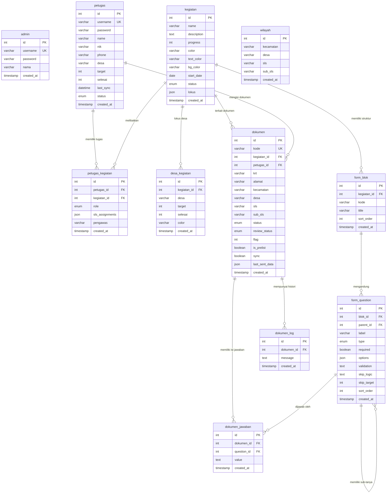

# 📚 Dokumentasi Lengkap Proyek: CANTIK (CAPI BPS Desa Cantik)

Aplikasi **CANTIK (Computer-Assisted Personal Interviewing - BPS Desa Cantik)** adalah platform pencacahan survei berbasis web yang dirancang khusus untuk petugas lapangan BPS (Badan Pusat Statistik) dalam mengumpulkan data survei sektoral secara langsung, serta untuk administrator dalam mengawasi progres dan mengelola kuesioner.

Aplikasi ini mengusung pendekatan **Offline-First** menggunakan teknologi **PWA (Progressive Web App)** dan **IndexedDB** agar petugas di daerah terpencil (minim sinyal) tetap dapat melakukan pendataan secara lancar tanpa kehilangan data.

---

## 🛠️ 1. Framework & Teknologi Utama beserta Alasan Pemilihan

Proyek ini dibangun menggunakan arsitektur **Client-Server** dengan pemisahan yang jelas antara Frontend (Client-Side) dan Backend (Server-Side). Berikut detail stack teknologi dan rasionalisasinya:

### A. Frontend (Client-Side)
*   **React 19 (v19.2.5)**
    *   *Alasan:* Library berbasis komponen paling populer yang menawarkan rendering DOM yang sangat efisien melalui Virtual DOM. Versi 19 menghadirkan penanganan *asynchronous actions* dan *form states* yang lebih baik, sangat membantu untuk kuesioner yang kompleks.
*   **Vite 8 (v8.0.16)**
    *   *Alasan:* *Build tool* generasi baru yang jauh lebih cepat dibanding Webpack. Menggunakan ES Modules asli untuk pengembangan (*Hot Module Replacement*) dan Rollup untuk build produksi, mempermudah konfigurasi PWA.
*   **Tailwind CSS v4 (v4.3.0) & PostCSS**
    *   *Alasan:* Pendekatan *utility-first* mempercepat desain UI tanpa perlu menulis CSS kustom yang banyak. Versi 4 menggunakan compiler CSS-first yang sangat optimal dan terintegrasi langsung dengan Vite (`@tailwindcss/vite`), mempercepat proses build.
*   **Lucide React (v1.14.0)**
    *   *Alasan:* Pustaka ikon berbasis SVG yang sangat ringan, konsisten, dan mudah disesuaikan warnanya langsung menggunakan class Tailwind.
*   **Recharts (v3.8.1)**
    *   *Alasan:* Library grafik deklaratif berbasis React dan SVG yang responsif. Sangat cocok untuk visualisasi grafik batang dan diagram lingkaran interaktif pada dashboard administrator.

### B. Backend (Server-Side)
*   **Node.js (ES Modules)**
    *   *Alasan:* Menyediakan runtime JavaScript berkinerja tinggi, berbasis event-driven dan non-blocking I/O. Menggunakan ES Modules (`import`/`export`) agar penulisan kode konsisten dengan frontend.
*   **Express.js 5 (v5.1.0)**
    *   *Alasan:* Framework minimalis dan fleksibel untuk membuat RESTful API di Node.js. Versi 5 menghadirkan penanganan error *asynchronous* yang lebih rapi secara bawaan.
*   **MySQL2 Driver (v3.14.0)**
    *   *Alasan:* Driver MySQL untuk Node.js dengan performa tinggi yang mendukung *Prepared Statements*, pooling koneksi, dan API berbasis Promise untuk penulisan kode asinkron modern dengan `async/await`.

### C. Database
*   **MySQL / MariaDB**
    *   *Alasan:* Relational Database Management System (RDBMS) yang sangat stabil, matang, dan mudah diintegrasikan dalam lingkungan Windows menggunakan XAMPP stack. Sangat cocok untuk data transaksional BPS yang memiliki relasi terstruktur.

---

## 💾 2. Desain Database & Skema Tabel

Database proyek ini dinamakan `desa_cantik`. Untuk mengantisipasi kuisioner dinamis (di mana pertanyaan dapat ditambah/dikurangi oleh admin secara *real-time* tanpa mengubah skema tabel), sistem menerapkan pola **Entity-Attribute-Value (EAV)** pada jawaban dokumen.

### Struktur Hubungan EAV (Dinamis):
1.  **`form_blok`** mendefinisikan kelompok/blok kuesioner.
2.  **`form_question`** menyimpan daftar pertanyaan secara dinamis beserta tipenya (text, select, radio, dll.) dan skema validasi.
3.  **`dokumen`** menyimpan header kuesioner rumah tangga (KRT, alamat, kecamatan, desa, status kirim).
4.  **`dokumen_jawaban`** menyimpan nilai riil per jawaban petugas dengan merujuk ke `dokumen_id` dan `question_id` (Struktur EAV).

---

### Detail Spesifikasi 11 Tabel Database:

#### 1. Tabel `admin` (Akun Administrator)
Menyimpan informasi login bagi staf pengawas atau administrator BPS.
*   `id` (INT, Primary Key, Auto Increment)
*   `username` (VARCHAR(50), Unique, Not Null) - Nama akun login.
*   `password` (VARCHAR(255), Not Null) - Hash password (bcrypt).
*   `nama` (VARCHAR(100), Not Null) - Nama lengkap admin.
*   `created_at` (TIMESTAMP, Default CURRENT_TIMESTAMP)
*   `updated_at` (TIMESTAMP, Default CURRENT_TIMESTAMP ON UPDATE CURRENT_TIMESTAMP)

#### 2. Tabel `petugas` (Akun Petugas Lapangan)
Menyimpan identitas, kuota target, progres, dan status keaktifan pencacah lapangan (PCL/PML).
*   `id` (INT, Primary Key, Auto Increment)
*   `username` (VARCHAR(50), Unique, Not Null) - Username login petugas.
*   `password` (VARCHAR(255), Not Null) - Hash password (bcrypt).
*   `name` (VARCHAR(100), Not Null) - Nama lengkap petugas.
*   `nik` (VARCHAR(20), Default Null) - NIK petugas.
*   `phone` (VARCHAR(20), Default Null) - Nomor telepon.
*   `desa` (VARCHAR(100), Default Null) - Desa domisili/fokus utama tugas.
*   `target` (INT, Default 0) - Target jumlah dokumen yang harus diselesaikan.
*   `selesai` (INT, Default 0) - Jumlah dokumen yang telah disetujui (Approved).
*   `last_sync` (DATETIME, Default Null) - Waktu terakhir sinkronisasi data offline ke online.
*   `status` (ENUM('active', 'done', 'inactive'), Default 'active')
*   `created_at` (TIMESTAMP, Default CURRENT_TIMESTAMP)
*   `updated_at` (TIMESTAMP, Default CURRENT_TIMESTAMP ON UPDATE CURRENT_TIMESTAMP)

#### 3. Tabel `kegiatan` (Proyek Survei/Sensus)
Menyimpan informasi proyek survei yang sedang berjalan di BPS.
*   `id` (INT, Primary Key, Auto Increment)
*   `name` (VARCHAR(200), Not Null) - Nama kegiatan survei (misal: "Desa Cantik 2026").
*   `description` (TEXT, Default Null) - Penjelasan detail kegiatan.
*   `progress` (INT, Default 0) - Progres persentase keseluruhan.
*   `color`, `text_color`, `bg_color` (VARCHAR(30)) - Kelas Tailwind untuk dekorasi kartu kegiatan di dashboard.
*   `start_date` (DATE, Default Null) - Tanggal dimulainya kegiatan.
*   `status` (ENUM('draft', 'published', 'uji_coba', 'selesai'), Default 'draft')
*   `lokus` (JSON, Default Null) - Wilayah cakupan kegiatan (Array kecamatan, desa, SLS, sub-SLS).
*   `created_at` (TIMESTAMP, Default CURRENT_TIMESTAMP)
*   `updated_at` (TIMESTAMP, Default CURRENT_TIMESTAMP ON UPDATE CURRENT_TIMESTAMP)

#### 4. Tabel `petugas_kegiatan` (Junction Table Petugas ↔ Kegiatan)
Menghubungkan petugas ke kegiatan tertentu beserta peran (role) dan alokasi wilayah SLS-nya.
*   `id` (INT, Primary Key, Auto Increment)
*   `petugas_id` (INT, Foreign Key ke `petugas.id` ON DELETE CASCADE)
*   `kegiatan_id` (INT, Foreign Key ke `kegiatan.id` ON DELETE CASCADE)
*   `role` (ENUM('PCL', 'PML'), Default 'PCL') - PCL (Pencacah Lapangan) atau PML (Pemeriksa Lapangan/Pengawas).
*   `sls_assignments` (JSON, Default Null) - Array nama SLS/RT yang ditugaskan kepada petugas.
*   `pengawas` (VARCHAR(100), Default Null) - Nama pengawas (PML) yang membawahi PCL ini.
*   `created_at` (TIMESTAMP, Default CURRENT_TIMESTAMP)
*   *Constraint:* `UNIQUE KEY` (petugas_id, kegiatan_id) mencegah duplikasi penugasan ganda petugas pada satu kegiatan.

#### 5. Tabel `wilayah` (Referensi Master Wilayah)
Menyimpan struktur referensi wilayah administratif flat (Kecamatan ➡️ Desa ➡️ SLS/RT ➡️ Sub-SLS).
*   `id` (INT, Primary Key, Auto Increment)
*   `kecamatan` (VARCHAR(100), Not Null)
*   `desa` (VARCHAR(100), Not Null)
*   `sls` (VARCHAR(100), Default Null)
*   `sub_sls` (VARCHAR(100), Default Null)
*   `created_at` (TIMESTAMP, Default CURRENT_TIMESTAMP)

#### 6. Tabel `desa_kegiatan` (Target & Realisasi per Desa per Kegiatan)
Menyimpan kuota target dan progres dokumen yang selesai untuk setiap desa per proyek survei.
*   `id` (INT, Primary Key, Auto Increment)
*   `kegiatan_id` (INT, Foreign Key ke `kegiatan.id` ON DELETE CASCADE)
*   `desa` (VARCHAR(100), Not Null) - Nama desa lokus kegiatan.
*   `target` (INT, Default 0) - Target jumlah sampel di desa tersebut.
*   `selesai` (INT, Default 0) - Jumlah sampel yang telah selesai di desa tersebut.
*   `color` (VARCHAR(10), Default '#2563eb') - Kode warna grafik desa pada dashboard admin.
*   `created_at` (TIMESTAMP, Default CURRENT_TIMESTAMP)
*   *Constraint:* `UNIQUE KEY` (kegiatan_id, desa) mencegah data target ganda per desa dalam satu kegiatan.

#### 7. Tabel `form_blok` (Blok Kuesioner)
Menyimpan nama-nama blok pembatas formulir (misal: "Blok I: Keterangan Tempat").
*   `id` (INT, Primary Key, Auto Increment)
*   `kegiatan_id` (INT, Foreign Key ke `kegiatan.id` ON DELETE CASCADE)
*   `kode` (VARCHAR(20), Not Null) - Kode blok (misal: "Blok I", "Blok II").
*   `title` (VARCHAR(150), Not Null) - Nama/Judul blok.
*   `sort_order` (INT, Default 0) - Urutan tampil blok.
*   `created_at` (TIMESTAMP, Default CURRENT_TIMESTAMP)

#### 8. Tabel `form_question` (Pertanyaan Kuesioner)
Menyimpan daftar pertanyaan yang di-render di formulir digital petugas.
*   `id` (INT, Primary Key, Auto Increment)
*   `blok_id` (INT, Foreign Key ke `form_blok.id` ON DELETE CASCADE)
*   `parent_id` (INT, Foreign Key ke `form_question.id` ON DELETE SET NULL) - Digunakan untuk sub-pertanyaan bersarang.
*   `label` (VARCHAR(300), Not Null) - Teks pertanyaan yang tampil di UI.
*   `type` (ENUM('text','number','select','radio','date','textarea'), Default 'text')
*   `required` (BOOLEAN, Default False) - Validasi apakah wajib diisi.
*   `options` (JSON, Default Null) - Pilihan jawaban jika tipe data berupa select/radio.
*   `validation` (TEXT, Default Null) - Aturan validasi kustom (misal batas rentang nilai angka).
*   `skip_logic` (TEXT, Default Null) - Logika lompatan pertanyaan (Skip Logic).
*   `skip_target` (INT, Default Null) - ID pertanyaan tujuan jika skip logic terpenuhi.
*   `sort_order` (INT, Default 0) - Urutan tampil pertanyaan di dalam blok.
*   `created_at` (TIMESTAMP, Default CURRENT_TIMESTAMP)
*   `updated_at` (TIMESTAMP, Default CURRENT_TIMESTAMP ON UPDATE CURRENT_TIMESTAMP)

#### 9. Tabel `dokumen` (Header Dokumen Kuesioner)
Menyimpan status lembar pengisian kuesioner rumah tangga.
*   `id` (INT, Primary Key, Auto Increment)
*   `kode` (VARCHAR(20), Unique, Not Null) - Kode unik lembar dokumen (misal: "RT-001").
*   `kegiatan_id` (INT, Foreign Key ke `kegiatan.id` ON DELETE CASCADE)
*   `petugas_id` (INT, Foreign Key ke `petugas.id` ON DELETE CASCADE)
*   `krt` (VARCHAR(100), Default Null) - Nama Kepala Rumah Tangga yang dicacah.
*   `alamat` (VARCHAR(200), Default Null) - Alamat rumah tangga.
*   `kecamatan`, `desa`, `sls`, `sub_sls` (VARCHAR(100)) - Detail wilayah administrasi objek cacah.
*   `status` (ENUM('draft', 'tersimpan', 'terkirim'), Default 'draft') - Status pengisian di sisi petugas.
*   `review_status` (ENUM('draft', 'approved', 'rejected'), Default 'draft') - Status verifikasi di sisi PML/Admin.
*   `flag` (INT, Default 0) - Penanda dokumen bermasalah/peringatan error validasi.
*   `is_prelist` (BOOLEAN, Default False) - Menandai apakah dokumen diimpor dari data prelist awal.
*   `sync` (BOOLEAN, Default False) - Menunjukkan apakah dokumen sudah berhasil tersinkronisasi ke server.
*   `last_sent_data` (JSON, Default Null) - Salinan cadangan data terakhir yang dikirim.
*   `created_at` (TIMESTAMP, Default CURRENT_TIMESTAMP)
*   `updated_at` (TIMESTAMP, Default CURRENT_TIMESTAMP ON UPDATE CURRENT_TIMESTAMP)

#### 10. Tabel `dokumen_jawaban` (Jawaban Dinamis - EAV Value)
Menyimpan semua nilai jawaban untuk setiap pertanyaan dari dokumen yang diisi.
*   `id` (INT, Primary Key, Auto Increment)
*   `dokumen_id` (INT, Foreign Key ke `dokumen.id` ON DELETE CASCADE)
*   `question_id` (INT, Foreign Key ke `form_question.id` ON DELETE CASCADE)
*   `value` (TEXT, Default Null) - Nilai jawaban yang diinput petugas.
*   `created_at` (TIMESTAMP, Default CURRENT_TIMESTAMP)
*   `updated_at` (TIMESTAMP, Default CURRENT_TIMESTAMP ON UPDATE CURRENT_TIMESTAMP)
*   *Constraint:* `UNIQUE KEY` (dokumen_id, question_id) mencegah jawaban ganda pada satu pertanyaan di dokumen yang sama.

#### 11. Tabel `dokumen_log` (Log Histori Dokumen)
Menyimpan riwayat status dokumen (misal: kapan dibuat, diedit, dikirim, ditolak beserta alasan penolakan).
*   `id` (INT, Primary Key, Auto Increment)
*   `dokumen_id` (INT, Foreign Key ke `dokumen.id` ON DELETE CASCADE)
*   `message` (TEXT, Not Null) - Deskripsi aktivitas log (misal: "Ditolak oleh PML Agus: Umur tidak valid").
*   `created_at` (TIMESTAMP, Default CURRENT_TIMESTAMP)

---

## 📊 3. Entity Relationship Diagram (ERD)

Berikut adalah visualisasi hubungan antartabel di dalam database `desa_cantik`:



---

## 🔄 4. Use Cases & Alur Kerja Pengguna

Aplikasi ini melayani dua peran utama dengan alur kerja yang saling berintegrasi:

### Use Case A: Administrator / PML (Pengawas)
```
[Login Admin] ──> [Monitor Progres Dashboard (Recharts)]
       │
       ├───> [Manajemen Master Petugas (Tambah/Edit Target/Cek Status)]
       │
       ├───> [Form Builder (Membuat/Mengedit Blok & Pertanyaan Kuesioner Dinamis)]
       │
       ├───> [Kelola Proyek Kegiatan (Draft, Publish, Selesai)]
       │
       └───> [Review Data Lapangan] ──> [Periksa Isian] ──> [Approve / Reject + Alasan]
```

*   **Dashboarding:** Melihat grafik batang pengiriman data harian dan diagram lingkaran rasio dokumen disetujui, ditolak, atau berstatus draft.
*   **Alokasi Sampel:** Mengimpor data prelist awal sebagai acuan petugas lapangan.
*   **Manajemen Form (Form Builder):** Membangun form secara interaktif untuk setiap kegiatan baru. Pertanyaan secara otomatis dipetakan ke driver database dengan skema EAV.
*   **Approval & Quality Control:** PML membaca isian kuesioner dari petugas. Jika terdapat anomali data (misal: jenis lantai tanah namun memiliki aset mobil mewah), PML dapat me-**Reject** kuesioner tersebut dan memberikan catatan kesalahan ke log dokumen.

### Use Case B: Petugas Lapangan / Pencacah (PCL)
```
[Login Petugas (NIP)] ──> [Pilih Wilayah Tugas & Kegiatan]
       │
       ├───> [Isi Kuesioner (Offline/Online)] ──> [Auto-Save ke LocalStorage & IndexedDB]
       │
       ├───> [Kelola Draft Kuesioner] ──> [Simpan Lokal]
       │
       └───> [Menu Sinkronisasi (Sync)] ──> [Kirim Antrian Data (Bulk Upload) saat Online]
```

*   **Pencacahan Lapangan:** Petugas mendatangi responden (KRT) dan menginput jawaban langsung di tablet/smartphone.
*   **Operasional Offline:** Jika tidak ada jaringan internet, aplikasi secara otomatis beralih ke mode offline. Data jawaban disimpan secara berkala ke cache browser (IndexedDB).
*   **Perbaikan Data:** Petugas melihat daftar dokumen berstatus "Rejected" di dashboard mereka beserta catatan revisi dari pengawas, melakukan edit lokal, lalu mengirimkannya kembali.
*   **Manual & Auto Sync:** Melalui menu Sync, petugas dapat memantau jumlah antrian dokumen yang belum dikirim dan menekan tombol sinkronisasi ketika sinyal stabil.

---

## 📱 5. Arsitektur PWA (Progressive Web App) & Offline-First

PWA dalam aplikasi CANTIK dirancang dengan cermat menggunakan `vite-plugin-pwa` dan pustaka IndexedDB kustom. Ini memastikan aplikasi dapat diinstal di homescreen layaknya aplikasi native dan tetap berfungsi 100% tanpa internet.

### A. Konfigurasi Service Worker & Workbox (`vite.config.js`)
Service worker didaftarkan dengan mode `registerType: 'autoUpdate'` untuk pembaruan latar belakang otomatis tanpa mengganggu pengalaman pengguna.
1.  **Workbox Precaching:** Menjaring seluruh aset statis web (`.html`, `.js`, `.css`, `.png`, `.svg`, `.ico`, `.woff2`) pasca-build agar halaman web dapat dimuat instan tanpa request ke jaringan internet.
2.  **Runtime Caching (Strategi Caching API):**
    *   **`StaleWhileRevalidate`** untuk API Form & Wilayah (`/api/form/.*`, `/api/wilayah/.*`): Aplikasi menyajikan versi cache yang ada terlebih dahulu agar UI termuat cepat, seraya diam-diam melakukan request ke jaringan untuk memperbarui cache di IndexedDB untuk penggunaan berikutnya. Cache berlaku selama 7 hari.
    *   **`NetworkFirst`** untuk API Dinamis (`/api/kegiatan`, `/api/petugas`, `/api/dashboard`, `/api/dokumen/.*`): Aplikasi akan selalu mencoba meminta data terbaru dari server terlebih dahulu (timeout 5 detik). Jika gagal karena offline, sistem langsung menyajikan data cadangan dari IndexedDB.
    *   **`CacheFirst`** untuk External Assets (Google Fonts & Gstatic Fonts): Mengurangi request berlebih ke CDN dengan menyimpan aset font di browser secara permanen (hingga 1 tahun).

### B. Penyimpanan Database Lokal (`src/services/offlineStorage.js`)
Aplikasi membuat database lokal bernama `cantik_offline_db` menggunakan API **IndexedDB** dengan 7 Object Store:
1.  `form_structure`: Menyimpan struktur pertanyaan kuesioner dinamis berdasarkan `kegiatan_id`.
2.  `wilayah`: Cache daftar kecamatan, desa, dan SLS referensi.
3.  `dokumen`: Menyimpan isian kuesioner berstatus draft/tersimpan milik petugas. Keypath menggunakan `kode` dokumen.
4.  `sync_queue`: Antrian pengiriman data HTTP POST/PUT yang tertunda karena offline.
5.  `kegiatan` & `petugas`: Cache data master kegiatan dan profil petugas.
6.  `meta`: Menyimpan data timestamp sinkronisasi terakhir.

### C. Mekanisme Sinkronisasi Antrian (`src/services/syncQueue.js`)
Ketika petugas menekan tombol kirim saat offline:
1.  Aplikasi membatalkan request HTTP normal untuk menghindari error crash.
2.  Data dokumen disimpan di store `dokumen` lokal dan antrian request-nya dimasukkan ke `sync_queue` IndexedDB dengan status `pending`.
3.  Aplikasi mendaftarkan event listener global `window.addEventListener('online')` dan `window.addEventListener('offline')` untuk memantau status jaringan perangkat.
4.  Saat mendeteksi perangkat kembali terhubung ke internet:
    *   Sistem menunggu 2 detik untuk memastikan stabilitas koneksi.
    *   Menjalankan fungsi `processQueue()`.
    *   Mengambil seluruh antrian request di `sync_queue`.
    *   Mengirimkannya satu per satu secara berurutan menggunakan metode `fetch()`.
    *   Jika API Server membalas dengan status HTTP 200/201 (Sukses), item tersebut dihapus dari antrian `sync_queue` dan status dokumen lokal diubah menjadi `sync = true`.
    *   Jika di tengah jalan koneksi putus kembali, proses sinkronisasi langsung diinterupsi secara aman tanpa merusak integritas data yang tersisa di antrian.

---

## ⚙️ 6. Konfigurasi Lingkungan & Aplikasi

### A. Environment Variables Backend (`server/.env`)
Buat file bernama `.env` di dalam folder `server/` dengan konfigurasi berikut:
```env
PORT=5174
CORS_ORIGIN=http://localhost:5173

# Database configuration (Sesuaikan dengan XAMPP MySQL Anda)
DB_HOST=127.0.0.1
DB_PORT=3306
DB_USER=root
DB_PASSWORD=
DB_NAME=desa_cantik
```

### B. Konfigurasi Server Vite (`vite.config.js`)
Agar aplikasi web PWA di laptop pengembang dapat diakses oleh HP petugas lapangan dalam satu jaringan Wi-Fi lokal, konfigurasi server Vite disetel sebagai berikut:
```javascript
server: {
  host: true,          // Mengaktifkan akses IP Address lokal (contoh: 192.168.1.10)
  port: 5173,
  strictPort: true,
  allowedHosts: ['.bpsktt.com'] // Mengizinkan akses via tunnel DNS kustom
}
```

---

## 🚀 7. Panduan Instalasi Lengkap (Langkah demi Langkah)

Ikuti instruksi berikut untuk menjalankan aplikasi CANTIK dari awal di komputer lokal Anda:

### Prasyarat Sistem:
*   **Node.js** versi 18 atau yang lebih baru.
*   **XAMPP** (Layanan MySQL / MariaDB diaktifkan).

---

### Langkah 1: Klon & Persiapan Folder Proyek
1.  Buka terminal (CMD / PowerShell / Bash).
2.  Masuk ke direktori kerja Anda (misal `c:\xampp\htdocs\Node-Project\cantik`).

---

### Langkah 2: Setup Database & Inisialisasi Data Awal (Seeding)
1.  Buka panel kontrol **XAMPP** dan aktifkan modul **MySQL** (Default Port: 3306).
2.  Masuk ke folder server proyek:
    ```bash
    cd server
    ```
3.  Instal seluruh modul dependensi backend:
    ```bash
    npm install
    ```
4.  Salin template environment variables ke file `.env` aktif:
    ```bash
    copy .env.example .env
    ```
    *(Gunakan `cp .env.example .env` jika menggunakan git bash/mac).*
5.  Jalankan skrip seeder otomatis:
    ```bash
    node db/seeder.js
    ```
    *Skrip ini secara otomatis akan:*
    *   Membuat database `desa_cantik` jika belum ada.
    *   Membaca file `db/schema.sql` dan membangun 11 tabel beserta relasi & index-nya.
    *   Menghapus data sampah (truncating) jika sebelumnya sudah ada.
    *   Melakukan hashing password aman menggunakan bcrypt.
    *   Memasukkan data seeder awal (1 Akun Admin, 5 Akun Petugas Lapangan, 4 Proyek Kegiatan, Struktur Wilayah, Form Kuesioner Blok I-V, dan 6 Draft Dokumen Sampel beserta jawaban dan log aktivitasnya).

---

### Langkah 3: Menjalankan Server Backend (API Express)
1.  Setelah proses seeding selesai, pastikan Anda masih berada di dalam folder `server`.
2.  Jalankan server Express dalam mode pemantauan developer (hot reload):
    ```bash
    npm run dev
    ```
    *Server backend sekarang berjalan aktif di `http://localhost:5174`.*

---

### Langkah 4: Menjalankan Server Frontend (React Client)
1.  Buka jendela terminal baru (split terminal).
2.  Pastikan Anda berada di root folder proyek utama (`cantik/`):
    ```bash
    cd ..
    ```
3.  Instal dependensi modul frontend:
    ```bash
    npm install
    ```
4.  Jalankan development server Vite:
    ```bash
    npm run dev
    ```
    *Aplikasi frontend Anda sekarang aktif di `http://localhost:5173`.*

---

### Langkah 5: Pengujian Login Awal
Buka browser Anda dan akses halaman `http://localhost:5173`. Cobalah login menggunakan akun hasil seeder berikut:

*   **Mode Administrator:**
    *   *Username:* `admin`
    *   *Password:* `admin123`
*   **Mode Petugas Lapangan:**
    *   *Username:* `budi.santoso`
    *   *Password:* `petugas123`

---

## 🛠️ 8. Pengujian Fitur PWA Secara Mandiri

Untuk menguji apakah fitur Progressive Web App (PWA) berjalan dengan benar:
1.  **Instalasi Aplikasi:** Pada bilah alamat browser Chrome/Edge, Anda akan melihat ikon tombol install "Instal CANTIK". Klik untuk menginstalnya ke desktop komputer.
2.  **Uji Mode Offline:**
    *   Buka menu Developer Tools (F12) ➡️ Tab **Application** ➡️ Pilih menu **Service Workers**.
    *   Centang kotak **Offline** untuk mensimulasikan kondisi tanpa internet.
    *   Lakukan reload halaman. Halaman web aplikasi CANTIK akan tetap termuat dengan sempurna tanpa koneksi internet.
    *   Lakukan pengisian kuesioner baru pada halaman petugas. Setelah disimpan, buka tab **IndexedDB** di Developer Tools untuk melihat isian data tersimpan dengan aman di dalam storage lokal browser Anda.
