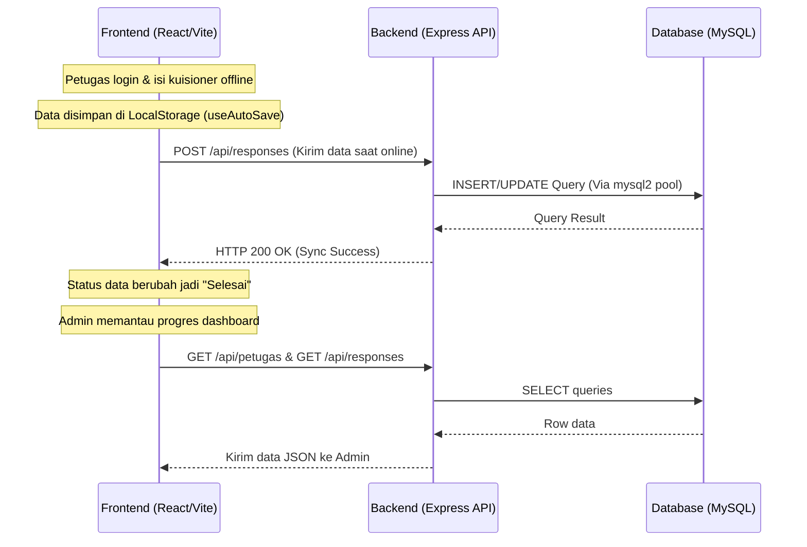

# Dokumen Informasi Teknologi - Proyek Desa Cantik (CAPI BPS)

Dokumen ini menjelaskan arsitektur sistem, struktur folder, teknologi frontend, teknologi backend, serta basis data (database) yang digunakan pada proyek **Desa Cantik (CAPI BPS)** berdasarkan analisis struktur file yang ada.

---

## 1. Arsitektur Utama (Overview)
Proyek ini mengadopsi struktur monorepo/kombinasi sederhana di mana frontend dan backend berada di dalam satu direktori induk (`cantik/`), namun terpisah secara dependensi dan proses eksekusi:
- **Frontend** berada di root direktori (`cantik/`) dan dikelola menggunakan **Vite** dan **React**.
- **Backend** berada di sub-direktori `server/` dan dikelola menggunakan **Node.js** dengan **Express**.
- **Database** menggunakan **MySQL** (biasanya diakses melalui XAMPP stack) dengan koneksi pool di sisi server.

---

## 2. Frontend (Client-Side)

Bagian frontend dibangun dengan fokus pada performa tinggi, tampilan visual yang modern, bersih, serta kemampuan operasi offline (offline-first design).

### A. Core Stack & Framework
- **React 19 (v19.2.5)**: Menggunakan versi React terbaru untuk manajemen komponen UI dan rendering yang efisien.
- **Vite (v8.0.10)**: Berperan sebagai build tool dan development server yang sangat cepat (menggunakan Hot Module Replacement / HMR).
- **ES Modules (ESM)**: Seluruh impor file menggunakan modul ES standar (`import/export`).

### B. Styling & Desain Visual
- **Tailwind CSS v4 (v4.3.0)**: Menggunakan versi terbaru Tailwind CSS yang terintegrasi langsung dengan compiler Vite (`@tailwindcss/vite`) dan PostCSS (`@tailwindcss/postcss`). Ini meminimalkan konfigurasi CSS tradisional.
- **Sistem Variabel CSS & Tema**: Didefinisikan di dalam `src/index.css`, mencakup palet warna profesional (slate, blue, emerald, amber, red), sistem elevasi bayangan (shadow), radius border, font tipografi, serta animasi transisi (`fade-in`, `slide-up`, `glassmorphism`, `card-hover`).
- **Google Fonts**: Menggunakan font **Archivo** untuk teks umum/UI dan **JetBrains Mono** untuk teks data teknis (monospaced) yang di-inject secara dinamis melalui komponen `GlobalStyles.jsx`.

### C. Libraries pendukung Frontend
- **Lucide React (v1.14.0)**: Pustaka ikon SVG minimalis dan modern yang konsisten di seluruh aplikasi (seperti ikon status, dokumen, user, sinkronisasi, dll.).
- **Recharts (v3.8.1)**: Pustaka grafik berbasis React untuk visualisasi data pencacahan pada dashboard admin (grafik batang kiriman harian, diagram lingkaran status dokumen, dll.).

### D. Fitur dan Struktur Halaman (`src/pages`)
Aplikasi ini memiliki 2 hak akses (role) utama yang diatur navigasinya menggunakan state di `src/App.jsx`:
1. **Halaman Autentikasi**:
   - `LoginScreen.jsx`: Halaman login minimalis dengan opsi masuk sebagai **Petugas** (Default NIP) atau **Admin**. Terdapat info integrasi offline.
2. **Fitur Petugas Lapangan (Officer Mode)**:
   - `PetugasHome.jsx`: Halaman utama petugas yang berisi daftar desa tugas, target dokumen, dan status pengumpulan.
   - `PetugasQuestionnaire.jsx`: Formulir wawancara elektronik (CAPI) untuk pengisian kuisioner oleh petugas di lapangan.
   - `PetugasSync.jsx`: Modul untuk sinkronisasi data yang disimpan secara lokal di perangkat ke server pusat secara massal saat ada jaringan.
   - `PetugasSettings.jsx`: Konfigurasi akun petugas serta pengaturan mode offline.
3. **Fitur Administrator (Admin Mode)**:
   - `AdminDashboard.jsx`: Dashboard utama pemantauan progres pencacahan nasional/daerah, statistik target vs realisasi, diagram lingkaran status dokumen, grafik batang kiriman harian, dan tabel keaktifan petugas.
   - `AdminDataReview.jsx`: Panel untuk memeriksa data kiriman petugas, melakukan approval (persetujuan) atau rejection (penolakan dengan catatan).
   - `AdminFormBuilder.jsx`: Pembuat form kuisioner dinamis secara visual untuk didistribusikan ke aplikasi petugas.
   - `AdminPetugas.jsx`: Manajemen data petugas (menambah, mengedit, menghapus petugas) dan alokasi wilayah tugas petugas.

### E. Layouts & Utilities
- **Layouts**: 
  - `AdminLayout.jsx`: Struktur layout admin dengan sidebar navigasi, header dashboard, dan dropdown pilihan proyek.
  - `PetugasLayout.jsx`: Struktur layout petugas lapangan yang ringkas dengan bilah navigasi bawah (bottom navigation) yang ramah perangkat seluler.
- **Hooks Kustom**:
  - `useAutoSave.js`: Untuk menyimpan draft kuisioner secara otomatis ke local storage agar tidak hilang saat mati lampu atau koneksi putus.
  - `useDropdown.js`: Manajemen state dropdown UI secara seragam.
- **Constants & Utils**:
  - `mockData.js`: Data tiruan untuk simulasi visual sebelum database terisi penuh.
  - `navigation.js`: Data struktur navigasi sidebar dan menu.
  - `formatters.js`: Helper pemformatan teks, tanggal, atau angka.

---

## 3. Backend (Server-Side)

Backend berfungsi sebagai penyedia REST API yang menjembatani aplikasi frontend dengan database MySQL.

### A. Core Stack
- **Node.js**: Menggunakan runtime JavaScript di sisi server dengan dukungan penuh ES Modules (`"type": "module"`).
- **Express (v5.1.0)**: Menggunakan framework Express versi 5 terbaru untuk routing dan penanganan middleware HTTP Request/Response secara cepat.

### B. Middleware & Konfigurasi Server
- **CORS (Cross-Origin Resource Sharing)**: Menggunakan package `cors` untuk mengizinkan request dari alamat frontend Vite (default: `http://localhost:5173`) dengan dukungan pengiriman kredensial/cookie.
- **Body Parser**: Menggunakan middleware bawaan Express (`express.json()`) untuk memparsing request body berformat JSON.
- **Dotenv**: Menggunakan package `dotenv` untuk memuat konfigurasi sensitif (port server, kredensial database) dari file `.env`.

### C. Struktur Routing (`server/routes/`)
- `routes/index.js`: Router utama Express yang memetakan endpoint API di bawah prefix `/api`.
  - `GET /api/health`: Health-check server untuk memeriksa status server dan waktu server saat ini.
  - `GET /api/petugas`: Endpoint data petugas (placeholder untuk integrasi DB).
  - `GET /api/responses`: Endpoint data respons dokumen kuisioner (placeholder untuk integrasi DB).

---

## 4. Basis Data (Database)

Sistem database dirancang menggunakan relational database management system yang andal untuk kebutuhan data tabular BPS.

- **DBMS**: **MySQL** (sangat cocok dijalankan di bawah stack XAMPP yang terpasang di sistem Windows Anda).
- **Konektor Driver**: **`mysql2/promise` (v3.14.0)**: Driver MySQL untuk Node.js yang mendukung fitur Promise sehingga query dapat ditulis menggunakan sintaksis modern `async/await`.
- **Pola Akses Database (Connection Pool)**: Dikonfigurasi di `server/config/database.js`. Menggunakan pooling koneksi dengan limit maksimal 10 koneksi simultan (`connectionLimit: 10`). Pooling ini menghemat beban server karena koneksi database dapat digunakan kembali (reuse) tanpa perlu membuka-tutup berulang kali pada setiap request.
- **Pengaturan Kredensial Database** (dikonfigurasi via `.env` di folder server):
  - `DB_HOST`: Host server database (default: `localhost` atau `127.0.0.1`).
  - `DB_PORT`: Port database MySQL (default: `3306`).
  - `DB_USER`: Username akses database (default: `root`).
  - `DB_PASSWORD`: Password database (default: kosong `""`).
  - `DB_NAME`: Nama database yang digunakan (default: `desa_cantik`).

---

## 5. Visualisasi Struktur Folder Proyek

Berikut adalah peta struktur folder dan file penting pada proyek ini:

```text
cantik/                           --> Root direktori proyek (Frontend React + Vite)
├── dist/                         --> Output hasil build frontend siap produksi
├── node_modules/                 --> Dependencies modul frontend
├── public/                       --> Asset publik statis frontend (favicon, logo, dll.)
├── src/                          --> Source code aplikasi utama frontend
│   ├── assets/                   --> Gambar atau media statis
│   ├── components/               --> Komponen React reusable
│   │   ├── layouts/              --> Layout halaman (AdminLayout.jsx, PetugasLayout.jsx)
│   │   └── ui/                   --> Komponen UI atomik (Badge, ConfirmModal, Dropdown, QCard)
│   ├── constants/                --> Konstanta aplikasi (mockData.js, navigation.js)
│   ├── hooks/                    --> Custom React hooks (useAutoSave.js, useDropdown.js)
│   ├── pages/                    --> Halaman-halaman aplikasi
│   │   ├── admin/                --> Fitur khusus Admin (Dashboard, Review, Form Builder, Petugas)
│   │   ├── auth/                 --> Fitur Login (LoginScreen.jsx)
│   │   └── petugas/              --> Fitur khusus Petugas (Home, Questionnaire, Sync, Settings)
│   ├── styles/                   --> Styling tambahan (GlobalStyles.jsx)
│   ├── utils/                    --> Helper functions (formatters.js)
│   ├── App.jsx                   --> Komponen router/state utama aplikasi
│   ├── index.css                 --> Konfigurasi & tema utama Tailwind CSS v4
│   └── main.jsx                  --> Entry point rendering React ke DOM
├── server/                       --> Direktori backend (Node.js + Express)
│   ├── config/                   --> Konfigurasi sistem backend
│   │   └── database.js           --> Koneksi pool database MySQL
│   ├── node_modules/             --> Dependencies modul backend
│   ├── routes/                   --> Router API Express
│   │   └── index.js              --> Endpoint routes (/health, /petugas, /responses)
│   ├── .env.example              --> Template konfigurasi environment variables (.env)
│   ├── index.js                  --> Entry point backend server Express
│   └── package.json              --> Dependensi backend (Express, Mysql2, dotenv, cors)
├── eslint.config.js              --> Konfigurasi linting JavaScript frontend
├── index.html                    --> Template HTML utama frontend
├── package.json                  --> Dependensi frontend (React, Recharts, Tailwind, Lucide)
├── postcss.config.mjs            --> Konfigurasi PostCSS untuk Tailwind CSS
├── tailwind.config.js            --> Konfigurasi tambahan Tailwind CSS
└── vite.config.js                --> Konfigurasi build tool Vite
```

---

## 6. Alur Kerja Integrasi Sistem



---

## 7. Cara Menjalankan Aplikasi

### A. Menjalankan Backend (Express Server)
1. Buka terminal baru dan masuk ke direktori server:
   ```bash
   cd server
   ```
2. Instal dependensi backend:
   ```bash
   npm install
   ```
3. Buat salinan file `.env` dari template:
   ```bash
   cp .env.example .env
   ```
4. Pastikan layanan MySQL Anda di **XAMPP** sudah menyala (Port: 3306) dan buatlah database kosong bernama `desa_cantik`.
5. Jalankan server dalam mode development:
   ```bash
   npm run dev
   ```
   *Server backend akan aktif di `http://localhost:5174`.*

### B. Menjalankan Frontend (Vite Client)
1. Buka terminal baru yang berbeda dan pastikan berada di root folder (`cantik/`).
2. Instal dependensi frontend:
   ```bash
   npm install
   ```
3. Jalankan development server:
   ```bash
   npm run dev
   ```
   *Frontend akan aktif di `http://localhost:5173` (atau port default Vite lainnya).*
